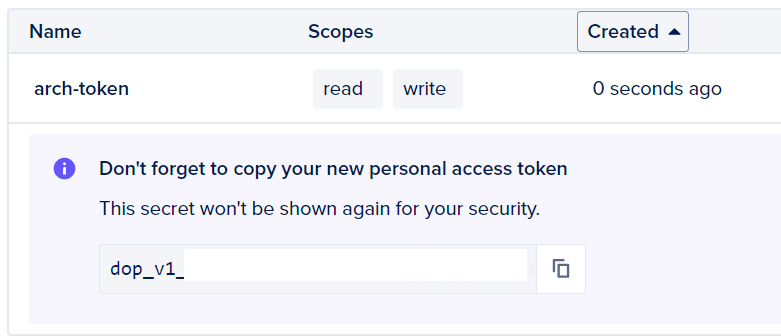
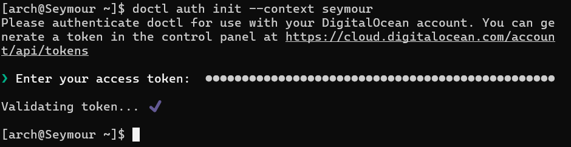

# Creating Digital Ocean Droplets using an existing Droplet
By the end of this tutorial you will have a good understanding of how to use an existing Digital Ocean Droplet to create new Droplets. This will be particularly useful in the future when you may need to create multiple Droplets with the same parameters.

Here is a brief overview of the steps you will take to accomplish your goal:
- Create ssh keys.
- Create a Personal Access Token for doctl to access your Digital Ocean account.
- Setup a Cloud-init configuration file for your new Droplets.
- Utilize doctl to create new Droplets using the Cloud-init config file, as well as your new ssh key.

To complete this tutorial you will just need a few things:
- Internet access.
- A Digital Ocean account.
- A Droplet running Arch Linux.
- A shell on your local machine to connect to your Droplet.

**Note:** Everything from here forward will be using your Arch Linux Droplet unless otherwise specified.

## Creating SSH Keys
SSH, also known as secure shell, is simply a way for us to remotely access another computer.

SSH keys are generally made up of two parts, the public key, and the private key. The public key can be thought of as a lock that we are using to secure the connection. The private key can be thought of as the key that unlocks the lock. Everybody can see the public key, but private keys are hidden.

1. Run the following command:
`ssh-keygen -t ed25519 -f ~/.ssh/do-key -C "<name>"`

- `ssh-keygen` is the command to create an ssh key.
- `-t` is to signify the type of key to create.
- `ed25519` is the type of key we are choosing to create.
- `f` is the filename for the key file
- `~/.ssh/do-key` is the key file. It's worth noting that `<do-key>` can technically be any file name, we are just using it as a short hand for "DigitalOcean-key".
- `-C` is to provide a comment.
- `<name>` is just a comment you can use to identify the key. Please insert your own in place of `<name>`.

2. Enter a blank passkey.

**Note:** Generally you should enter a passkey, but in this situation you will not have any sensitive information on your Droplet so it is not neccessary.

If successful, you should now see a key fingerprint and some random art.


Optionally you can type `find .ssh` to confirm your key exists. 

This will print out all the files within our `.ssh/` directory, given it exists.

## Setting up Cloud-init
Cloud-init is essentially used for launching remote cloud servers. In this case we will be creating a cloud-init configuration file for any new Droplets we creating. This is useful because we can do things like initialize users, set their privileges, and pre-download packages.

1. Type `nvim cloud-init-arch-config.yml` to create a .yml cloud-init config file using neovim.

**Note:** .yml or .yaml files are essentially human readable config files, kind of like json.

2. Copy and paste the code block below into neovim, filling in the `<name>` sections with a nickname.

**Note:** Typing `i` will put vim into insert mode where you can edit text, `esc` is used to exit insert mode. Typing `:wq` will write and quit vim, saving your data.

```
#cloud-config
users:
  - name: <name>
    primary_group: <name>
    groups: wheel
    sudo: ['ALL=(ALL) NOPASSWD:ALL']
    shell: /bin/bash
    ssh-authorized-keys:
      - <ssh public key>

packages:
  - ripgrep
  - rsync
  - neovim
  - fd
  - less
  - man-db
  - bash-completion
  - tmux

disable_root: true
```

- `users` specifies the follow entries are us adding a user.
    - `name` is the name of the user.
    - `primary_group` is the group associated to this user. It's good practice for this to just be the same as the user's name.
    - `groups` are additional groups that we are adding the new user to. In this case we are adding them to the `wheel` group, which allows them to use `sudo` which elevates commands to a root user's privilege.
    - `sudo` specifies what the sudo command allows the user to do. In this case they are allowed to do anything, without any password to block them.
    - `shell` specifies the location of the shell.
    - `ssh-authorized-keys` adds the corresponding key to the user's authorized keys file.
- `packages` preinstalls all the corresponding packages to the user's instance.
- `disable_root` disables access to the root user on the instance. This is good practice since the user can already use commands at a root user's privilege level using sudo. We can also track users usage of the sudo command, whereas if we allow access to the root user we could not.

Now we have to go back and copy our SSH key so that we can add it to our config file.

3. Type `cat .ssh/do-key.pub`, this will output the public key we made earlier given you also named it `do-key`.

4. Copy the public key to the clipboard.

5. Type `nvim cloud-init-arch-config.yml` to once again open our file in neovim.

6. Type `i` to enter insert mode, and then paste your public key where it says `<ssh public key>`, deleting the placeholder text before doing so.

7. Click `esc` to exit insert mode.

At this point your file should look something like this:


8. Type `:exit` once again to leave nvim.

## Initializing a Droplet using doctl
You will now be installing doctl and using it to initialize an Arch Linux Droplet. doctl is the command line interface that Digital Ocean uses to manage droplets. In this case we will be using it to create a Droplet.

### Installing doctl

1. Type `sudo pacman -S doctl` to install the doctl package.

- `sudo` elevates our privileges to the root user level, like previously mentioned.
- `pacman` is the Arch Linux package manager.
- `-S` stands for synchronize packages. This option makes it so that while installing the specified packages, in this case `doctl`, it will also install any dependencies. Dependencies are packages that `doctl` requires to function.
- `doctl` simply specifies which package we want to install.

### Creating a Personal Access Token
We will take a quick aside back to our local machine to create a Personal Access Token. This Token will allow `doctl` to access our Digital Ocean account remotely.

2. Open https://cloud.digitalocean.com/account/api/tokens on your local machine.
3. Click **Generate New Token**.


4. Give your token a meaningful name, and specify full access.


**Note:** You can choose what commands your token has access to, but for this tutorial we will just set a 30 day expiry and allow full access.

5. Copy the token provided once the page redirects.



### Using doctl to Access Digital Ocean
For the remainder of the tutorial we will be back in our Arch Linux Droplet.

6. Run the following command.
`doctl auth init --context <name>`

- `auth` specifies an authentication command for your Digital Ocean.
- `init` specifies that we will be initializing a new account.
- `--context` followed by `<name>` is specifying the name we will associate with the new account.

7. Paste your token when prompted.

**Note:** If you have done this correctly you should be met with a check mark after validating your token.



8. Run the following command.
`doctl auth switch --context <name>`

- `switch` specifies that we will be switching to the account.
- `--context <name>` once again specifies which account we will be switching to, in this case `<name>` is exactly what you used in step 6.

9. Run `cat ~/.ssh/do-key.pub` and copy your public key again.

10. Run the following command.

`doctl compute ssh-key create <name> --public-key "<public key>"`

- `doctl compute ssh-key` specifies our next command will be one of the doctl ssh-key commands.
- `create <name>` specifies that we will be creating a new ssh key with the `<name>` as a nickname.
- `--public-key` followed by our public key simply tells Digital Ocean that that's the key we want to associate with the nickname.

If you did this correctly you should see the key printed back to you with an ID attached.


**Note:** If you ever forget the key ID, you can simply run `doctl compute ssh-key list` to see all your keys.

11. Run the following to get the ID related to your Arch Linux image.
`doctl compute image list-user`

- `doctl compute image` specifies our next command will be a doctl image command.
- `list-user` will then print out the images that we have uploaded to our account. In this case it should just be our Arch Linux image unless you have uploaded others.


Now that we have the image ID, the public key ID and a cloud-init config file, we can finally run a command to initialize a new Droplet.

12. Run the following, filling in the placeholders below with your own data:

- `<DROPLET_NAME>` Should be a name you want to give your new droplet.
- `<IMAGE_ID>` Should be the image ID number we found in Step 11.
- `<PUBLIC_KEY_ID>` Should be the public key ID number we found in Step 10.
- `<CONFIG_PATH>` Should be the path to your cloud-init .yml file.

`doctl compute droplet create <DROPLET_NAME> --region sfo3 --image <IMAGE_ID> --size s-1vcpu-1gb-intel --ssh-keys <PUBLIC_KEY_ID> --user-data-file <CONFIG_PATH>`

- `doctl compute droplet` specifies we will be running a doctl droplet command.
- `create` specifies that we will be creating a new droplet with `<DROPLET_NAME>` as the name.
- `--region` specifies which region to launch the droplet, in this case we are picking `sfo3` San Francisco 3 because it's close to us.
- `--image` chooses an image from our account using it's ID.
- `--size` specifies the hardware of the droplet, in this case it's the same as our Arch droplet.
- `--ssh-keys` specifies which public key to use off our account.
- `--user-data-file` specifies that we would like to configure the droplet with the cloud-init settings in the .yml file path we're linking.

If you did everything right up until this point you should be met with a response that looks something like this:


Sure enough, if we check our Digital Ocean account, our Droplet is up and running.


# References

[^1]https://www.markdownguide.org/
[^2]https://docs.cloud-init.io/en/latest/index.html
[^3]https://www.digitalocean.com/community/tutorials/how-to-use-cloud-config-for-your-initial-server-setup
[^4]https://docs.digitalocean.com/reference/doctl/
[^5]https://www.ssh.com/academy
[^6]https://docs.digitalocean.com/reference/api/create-personal-access-token/